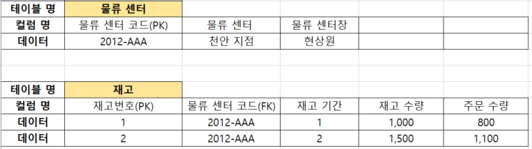

### 정규화 란?

    관계형 데이터베이스의 설계에서 중복을 최소화하게 데이터를 구조화하는 프로세스를 정규화(Normalization)라고 한다.

### 테이블 관계

    One to One : 1:1 관계 (결혼, 군인총기, 주민등록번호)
    One to Many : 1:N 관계 (회사와 직원, 팀과 선수)
    Many to Many : M:N 관계 (요리사와 재료가 있어야 요리 탄생)

### 정규화 맛보기 :smile:

- 모델링 예제 1번

  

  상품테이블은 브랜드명과 물품가, 출하가를 모두 기록하고 있다.
  리바이스 바지 물품가는 5,000 이라고 가정하면,
  위 테이블에서는 브랜드 마다 각기 다른 물품가와 출하가를 입력할 수 없다.

- 모델링 예제 1번 정답

  

  바지 테이블을 만들어 상품 테이블에 바지 코드를
  참조하면 된다.

- 모델링 예제 2번

  

  물류센터 테이블은 재고 1개월~2개월 수량, 주문 수량을 파악하고 있다. 만약 3개월, 4개월, 5개월 수량과 주문 수량을 파악해야 한다면 컬럼을 계속 추가해야 한다.
  **ex) 재고 3개월 수량, 재고 4개월 수량, 재고 5개월 수량 ...**

- 모델링 예제 2번 정답

  

  재고 테이블에 재고 기간 컬럼을 만들어
  원하는 기간을 자유롭게 넣을 수 있다.
  재고 테이블에 물류센터코드를 참조하여 다른 지역에 있는 물류 센터 수량, 주문 수량을 관리할 수 있다. **(아래 사진 참고)**

  
