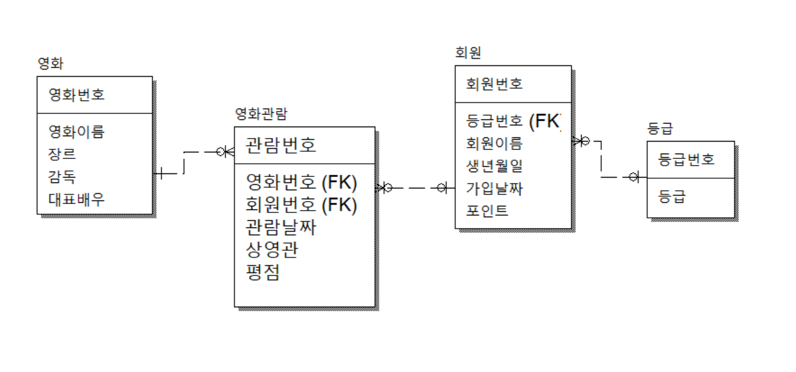

### 모델링 조건(수많은 조건이 있지만, 아래 2개는 알아두자!)

    1. 테이블에 NULL이 많으면 정규화 고려 대상.
    2. 해당 테이블에 연관 있는 컬럼인지?
        ex) 테이블이름은 헬스장인데 컬럼이름은 영화이름..

### 모델링 예제 (영화)

    주제 : 영화관
    영화관 테이블에는 현재 상영 중인 영화를 관리한다.
    회원 테이블에는 회원 정보와 포인트를 관리한다.
    회원이 영화를 볼 때 마다
    영화관람 테이블에 날짜와 시청한 영화를 기록해야 한다.
    추가사항) 포인트가 500점이 넘으면 GOLD 회원
    포인트가 1000점이 넘으면 PLATINUM 회원
    포인트가 1500점이 넘으면 DIAMOND 회원

### 모델링 결과

    등급과 회원은 One to Many(1:N) 관계를 가짐.
    영화관람은 Many to Many(N:M) 관계를 가짐.
