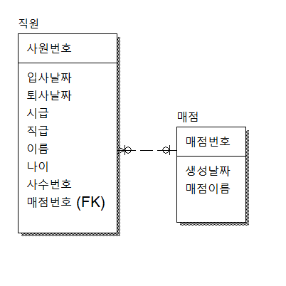

### 영화 테이블 정규화 응용하기

    One to Many, Many to Many, One to One을 계속 익혀보자.

#### 요구사항 1번 (Many to Many)

    요구사항 :
    영화관은 여러 회원을 모집하고 있다.
    회원은 여러 영화관에 회원가입할 수 있다.

    문제풀이 :
    (서론)
    회원은 여러 영화관에 회원가입할 수 있고, 영화관은 여러 회원을 모집중.
    (본론)
    1. ***회원은 여러 영화관 선택.
    2. ***영화관은 여러 회원을 받을 수 있음.
    3. 서로 여러 데이터를 선택할 수 있음.
    4. Many to Many 관계를 가지게 됨.
    (결론)
    Many to Many 관계이기 때문에 새로운 테이블을 만들어야 함.
    회원 번호와 영화관 번호를 중복가능하게 만들어야 한다.

#### 요구사항 2번 (One to One)

    요구사항 :
    영화관에 매점을 오픈하려고 한다.
    매점은 오직 하나의 영화관에만 소속될 수 있다.
    영화관도 매점 한개만 오픈할 수 있다.

    문제풀이 :
    (서론)
    영화관에 매점 1개만 입점할 수 있고 매점은
    다른 영화관에 입점할 수 없다.
    (본론)
    1. ***매점은 영화관 한 곳만 선택 가능.
    2. ***영화관은 매점 1개만 입점 가능.
    3. 서로 하나씩만 선택할 수 있음.
    4. One to One 관계를 가지게 됨.
    (결론)
    One to One 관계이기 때문에 참조되는 키에 UNIQUE KEY를 부여해서 중복방지를 해야 함.

#### 요구사항 3번 (One to Many)

    요구사항 :
    매점이 오픈 되었습니다. 직원을 채용해야 함.
    매점엔 여러직원을 채용할 수 있고,
    직원은 매점 한곳만 등록 가능할 수 있다.

    문제풀이 :
    (서론)
    매점은 직원들을 채용해야 하고 직원은 다른 매점에
    취업할 수 없다.
    (본론)
    1. ***매점은 여러 직원 채용.
    2. ***직원은 매점 한 곳만 일할 수 있음.
    3. 매점엔 여러 직원이 있음.
    4. One to Many 관계를 가지게 됨.
    (결론)
    One to Many 관계이고 직원은 여러 매점에 일할 수 없으므로, 직원 테이블에 매점 번호가 참조키(FK)가 된다.

