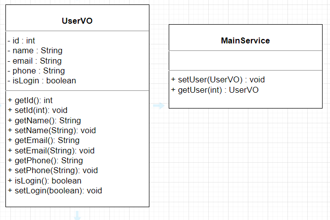

## 여러 클래스 만들어보기

### step 1. 
    service 라는 이름의 패키지 만들기

### step 2.
    아래 3개 클래스 생성.
    MainController.java
    MainService.java
    UserVO.java 

### step 3.
    UserVO, MainService UML은 아래와 같음

### step 4.
    MainController 파일에서 Main메소드 생성

### step 5.
    5-1. main 메소드에서 UserVO 클래스 호출(객체 생성)
    5-2. main 메소드에서 MainService 클래스 호출(객체 생성)
    5-3. MainService getUser 메소드 호출
    5-4. getUser 메소드 로직 아래와 같이 추가할 것.
         파라미터에 1이상 100이하 숫자 입력.
         파라미터 데이터가 UserVO 필드변수 id에 대입.
         UserVO set 메소드 사용해서 id를 제외한 필드변수 데이터 대입.
    5-5. main에서 getUser 메소드 리턴 결과 출력

### 예상 결과
    *파라미터로 받은 id와 이름만 출력
    "id : 30"
    "name : 현상원"

### 공유폴더 경로
공유폴더 -> 현상원 -> JAVA -> JAVA_클래스_문제 -> step2_문제제출