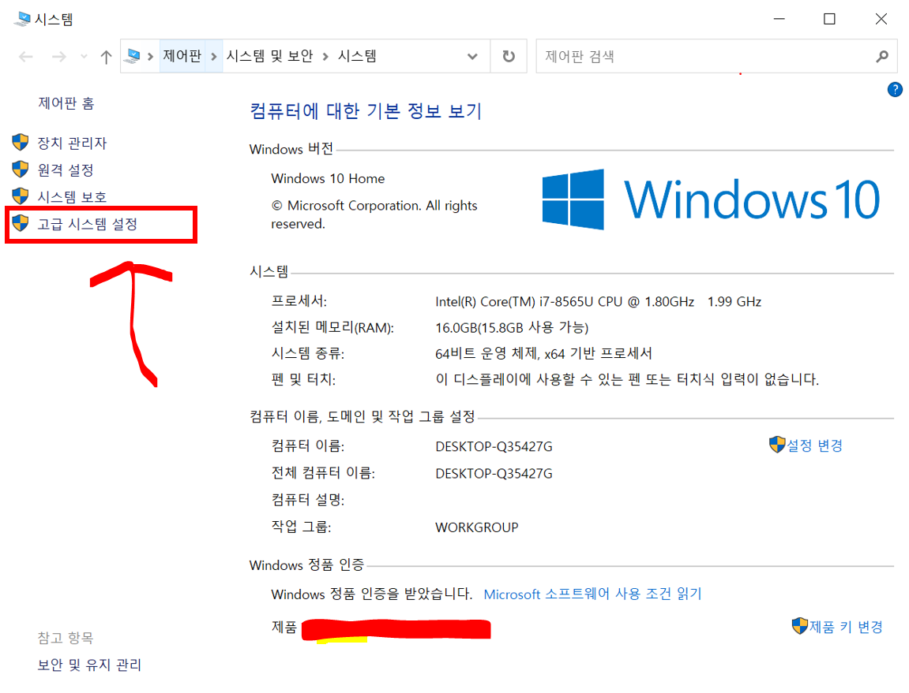
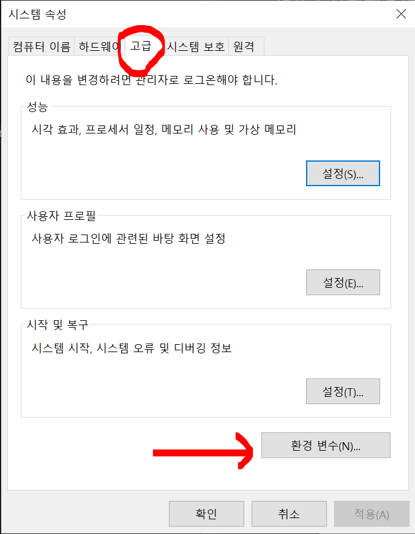
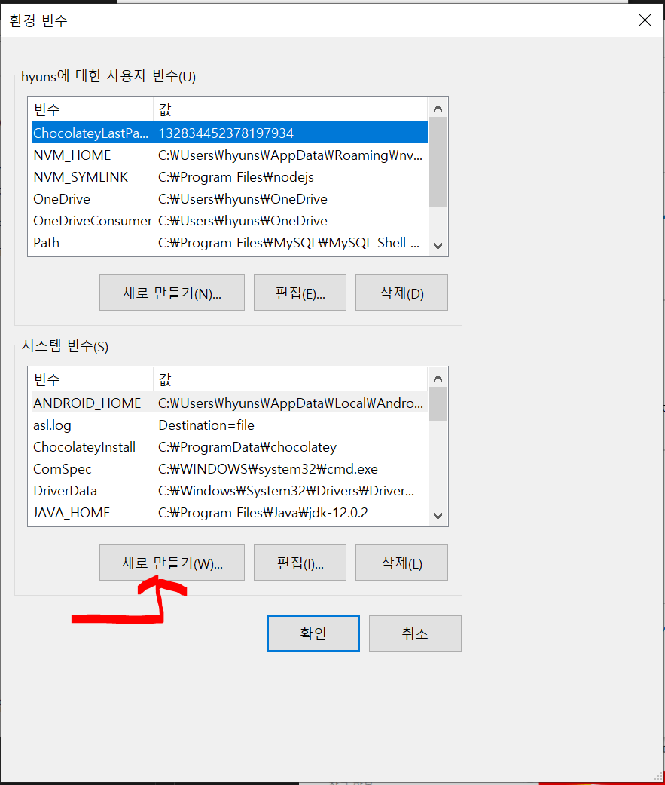
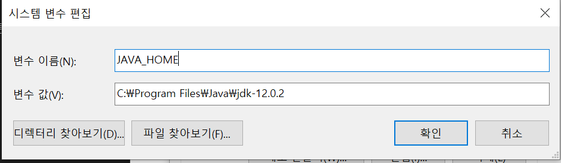
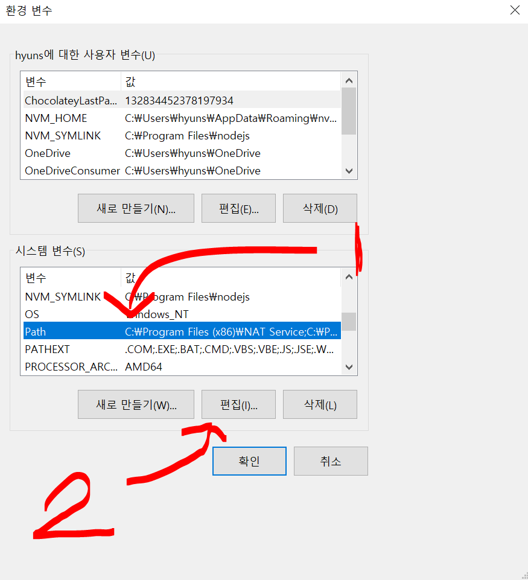
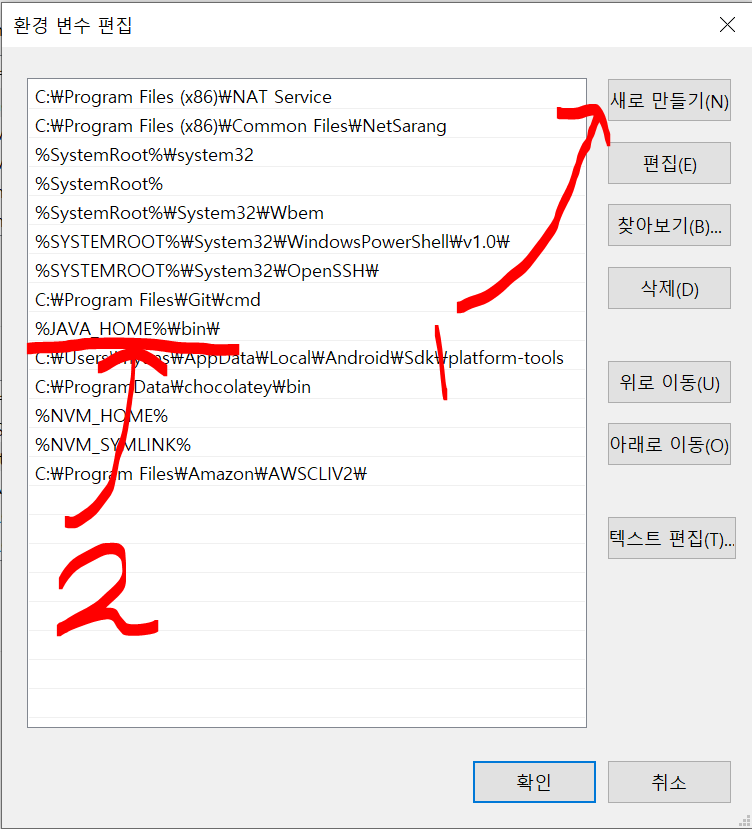
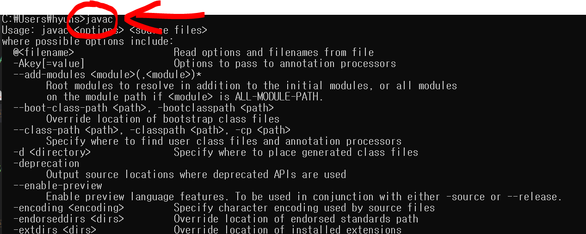

### JDK ?
- JDK는 자바 프로그램을 생성할 수 있게 해줌.

### JDK를 설치했으면 컴퓨터에 자바를 설정해야함.
- 공유폴더에 있는 JDK설치 必

### JDK 설치 후 설정 ( *윈도우 10 기준)
1. 내PC에 접속해서 흰 배경에 마우스 오른쪽 클릭 (클릭하면 작은 화면이 나옴)
2. 속성 클릭 -> 고급 시스템 설정 

3. 환경변수 클릭

4. 시스템 변수 새로만들기 버튼 클릭

5. 변수 이름에 : JAVA_HOME, 변수 값에 : JDK(Java Development Kit)가 설치된 폴더 경로 (기본 경로 : C:\Program Files\Java\jdk-12.0.2)입력 후 확인 버튼 클릭

5. 변수이름 path 찾기 -> 편집버튼 클릭 

6. 새로만들기 버튼 클릭 -> %JAVA_HOME%\bin\ 입력-> 확인 버튼 클릭

7. ***지금까지 켰던 화면 모두 확인 버튼 클릭!

8. cmd화면 -> javac 명령어 입력 (아래 사진 최종 확인)
