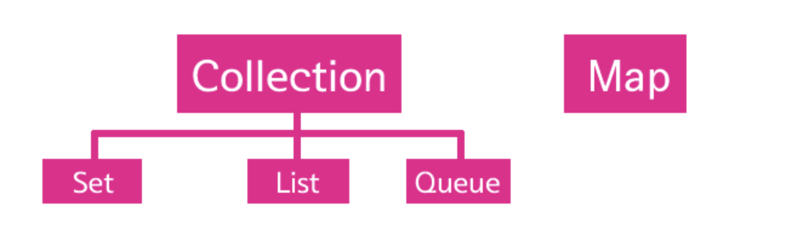
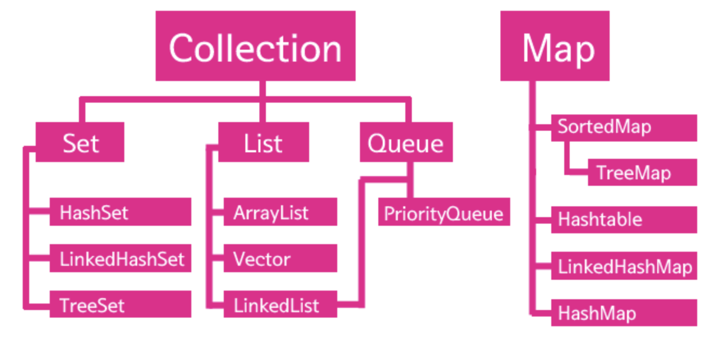

## 컬렉션즈 들어가기 앞서...

    연관된 데이터를 관리하기 위해서 배열을 사용했다.
    그런데 배열에는 몇가지 불편한 점이 있었는데 그 중의 하나가 한번 정해진 배열의 크기를 변경할 수 없다는 점이다.
    이러한 불편함을 컬렉션즈를 사용하면 줄어든다.
    컬렉션즈 덕분에 자료구조 공부없이도 쉽게 코딩할 수 있게 되었다.

## 컬렉션즈란?

    컬렉션즈 무엇인가 본격적으로 알아보자. 컬렉션즈 프래임워크라는 것은 다른 말로는 컨테이너라고도 부른다. 즉 값을 담는 그릇이라는 의미이다. 그런데 그 값의 성격에 따라서 컨테이너의 성격이 조금씩 달라진다. 자바에서는 다양한 상황에서 사용할 수 있는 다양한 컨테이너를 제공하는데 이것을 컬렉션즈 프래임워크라고 부른다.



    Collection과 Map이라는 최상위 카테고리가 있고, 그 아래에 다양한 컬렉션들이 존재한다. 그럼 구체적인 컬렉션즈 프래임워크 클래스들을 살펴보자.



    ArrayList, HashMap, HashSet가 대표적이고, ArrayList는 정말 많이 사용한다.

### List와 Set차이

    List와 Set의 차이점은 List는 중복을 허용하고, Set은 허용하지 않는다.

```java
    //<> : 제네릭이다.
    //<> 안에 지정된 데이터 타입에 의해서 결정된다.
    //<> 안에는 클래스 데이터 타입만 올 수 있다.
    ArrayList<String> al = new ArrayList<String>();
    al.add("one");
    al.add("two");
    al.add("two");
    al.add("three");
    al.add("three");
    al.add("five");

    Iterator ai = al.iterator();
    while(ai.hasNext()){
        System.out.println(ai.next());
    }

    HashSet<String> hs = new HashSet<String>();
    hs.add("one");
    hs.add("two");
    hs.add("two");
    hs.add("three");
    hs.add("three");
    hs.add("five");
    Iterator hi = hs.iterator();
    while(hi.hasNext()){ // hasNext : 반복할 데이터가 더 있으면 true, 더 이상 반복할 데이터가 없다면 false를 리턴한다.
        System.out.println(hi.next()); //hasNext가 true라는 것은 next가 리턴할 데이터가 존재한다는 의미다.
    }
```

### Map

    Map 컬렉션은 key와 value의 쌍으로 값을 저장하는 컬렉션이다.

```java
    HashMap<String, Integer> a = new HashMap<String, Integer>();
    a.put("one", 1);
    a.put("two", 2);
    a.put("three", 3);
    a.put("four", 4);
    System.out.println(a.get("one"));
    System.out.println(a.get("two"));
    System.out.println(a.get("three"));
```

### 데이터 타입의 교체

    컬렉션을 사용할 때는 데이터 타입은 가급적 해당 컬렉션을 대표하는 인터페이스를 사용하는 것이 좋다.

```java
HashMap<String, Integer> a = new HashMap<String, Integer>();
/*
이것을 아래와 같이 수정한다. HashMap은 Map 인터페이스를 구현하기 때문에 변수 a의 데이터 타입으로 Map을 사용할 수 있다.
어떤 필요에 의해서 컬렉션을 HashMap에서 HashTable로 바꾸고 싶다면 아래와 같이 수정하면 된다.
*/
Map<String, Integer> a = new HashMap<String, Integer>();
Map<String, Integer> a = new Hashtable<String, Integer>();
```
