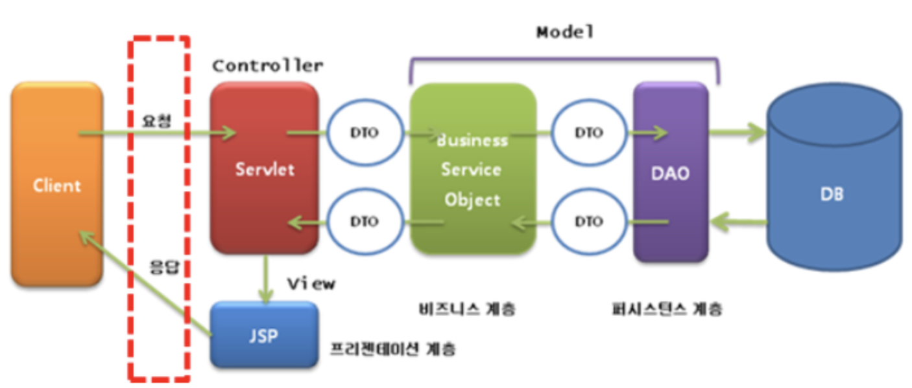

## MVC (Model–View–Controller)

    소프트웨어 공학에서 사용되는 소프트웨어 디자인 패턴.
    로직을 서로 영향 없이 쉽게 고칠 수 있는 애플리케이션을 만들 수 있다.

### Model(비즈니스 계층, 퍼시스턴스 계층)

    비즈니스 로직, 데이터(CRUD) 등의 기능.

### Controller

    요청을 받아서 화면과 Model를 연결시켜주는 역할.

### View (프리젠테이션 계층)

    최종 사용자에게 결과를 화면(UI)으로 보여줌

#### MVC 이미지

