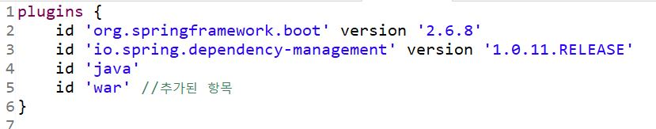
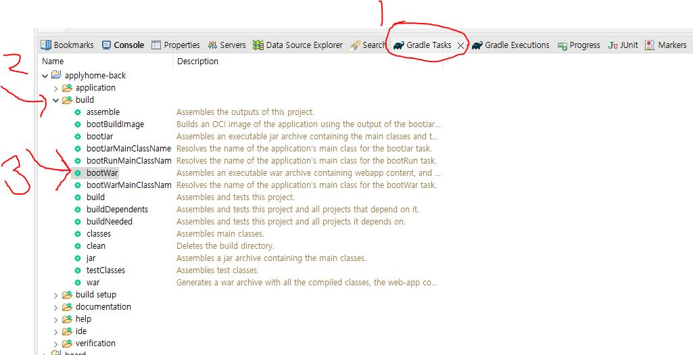
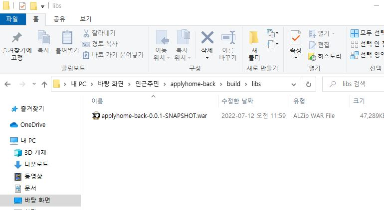
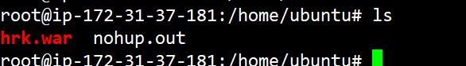

### 배포(Deploy)

    내가 만든 프로그램을 서버와 같은 기기에 설치하는 행위

### Spring boot 배포

    스프링 부트 배포방법은 크게 jar와 war가 있음.
    스프링 부트는 내장톰캣이 있기 때문에 jar, war 압축 가능.
    스프링 부트를 제외한 일반 스프링, 이고브는 war만 가능!
    jar로 압축하면 톰캣설치 없이 스프링을 실행할 수 있음.
    war로 압축하면 톰캣을 별도로 설치해야 하지만 스프링 부트는 내장 톰캣이 있기 때문에 war안에 내장톰캣을 넣을 수 있음!
    내장톰캣 분리하고 war를 하면 배포하는 서버에 톰캣을 별도로 설치해야 함!

    1. 내장톰캣 + jar
    2. 내장톰캣 + war
    3. 내장톰캣(x) + war

### Spring Boot + JSP 배포 방법 (CentOS 기준)

1. build.gradle 에서 war 추가
   
2. Gradle Tasks -> build -> bootWar 실행
   
3. 프로젝트 libs 폴더 들어가서 war 파일 확인
   
4. war파일을 EC2 /home/ubuntu 경로에 업로드
   
5. nohup 명령어를 이용해서 war파일 백그라운드 실행

```bash
    nohup java -jar hrk.war &
```

6. netstat 명령어로 해당 war 실행되었는지 확인

```bash
    netstat -tnlp

```

### Spirng 부트 톰캣 분리하기

1. gradle에 톰캣 추가

```gradle
providedRuntime 'org.springframework.boot:spring-boot-starter-tomcat'
```

2. java 메인함수에 SpringBootServletInitializer 상속받기

```java
@SpringBootApplication
public class BoardApplication extends SpringBootServletInitializer{

	public static void main(String[] args) {
		SpringApplication.run(BoardApplication.class, args);
	}

	@Override
	protected SpringApplicationBuilder configure(SpringApplicationBuilder application) {
		return application.sources(BoardApplication.class);
	}

}
```

### Spring 배포시 주의사항

1. 포트번호가 겹치는지 확인
2. 데이터베이스가 연결되어 있다면 주소 확인
3. Spring boot + jsp는 jar로 압축배포 불가능
